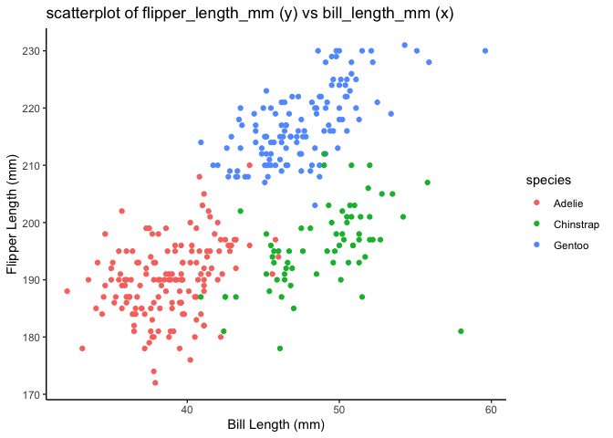

p8105_hw_jz3900
================
ELisajava
2024-09-21

This is my R Markdown file for P8105 HW1 (jz3900)

Load the tidyverse function for HW1

``` r
library(tidyverse)
```

# Problem 1

The task involves providing a brief description of the penguins dataset,
which includes:

- The data in the dataset, including the names and values of important
  variables

- The size of the dataset

- The mean flipper length

- Creating a scatterplot

Load the penguins dataset from the “palmerpenguins” package:

``` r
data("penguins", package = "palmerpenguins")
```

## Names of the dataset

``` r
names(penguins)
```

    ## [1] "species"           "island"            "bill_length_mm"   
    ## [4] "bill_depth_mm"     "flipper_length_mm" "body_mass_g"      
    ## [7] "sex"               "year"

It shows that the names in the penguins dataset are: bill_depth_mm,
bill_length_mm, body_mass_g, flipper_length_mm, island, sex, species,
year.

## The size of the dataset

The size of the dataset is 344 rows and 8 columns

## The mean flipper length

The mean flipper length is 200.9152047

## Creating scatterplot

Use this code to create a scatterplot with flipper_length_mm on the
y-axis and bill_length_mm on the x-axis, using different colors for each
species:

``` r
#create a scatterplot
scatterplot = ggplot(penguins, aes(x = bill_length_mm, y = flipper_length_mm, color = species)) +
  geom_point(na.rm = TRUE) +
  labs(
    title = "scatterplot of flipper_length_mm (y) vs bill_length_mm (x)",
    x = "Bill Length (mm)",
    y = "Flipper Length (mm)"
  ) +
  theme_classic()
print(scatterplot)
```

<!-- -->

``` r
# save the scatterplot
ggsave(filename = "scatterplot_flipper_vs_bill.png", plot = scatterplot, width = 8, height = 8)
```

# Problem 2

This problem involves creating a data frame that includes:

- A random sample of size 10 from a standard normal distribution
- A logical vector indicating whether the elements of the sample are
  greater than 0
- A character vector of length 10
- A factor vector of length 10 with three distinct factor levels
- attempt to calculate the mean of each variable in the data frame.

## Create data frame

### First, create four variables describes in the problem 2:

Create a random sample:

``` r
random_samp = rnorm(10)
```

Create a logical vector:

``` r
logical_vec = random_samp > 0
```

Create a character vector of length 10:

``` r
char_vec = sample(c("1","2","3"), size=10, replace = TRUE)
```

Create a factor vector:

``` r
factor_vec = factor(sample(c("Low", "Medium", "High"), size = 10, replace = TRUE))
```
